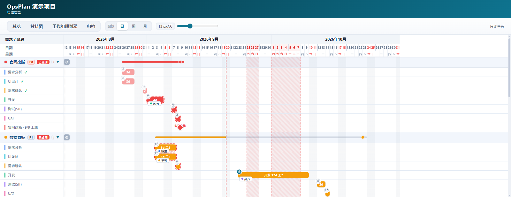
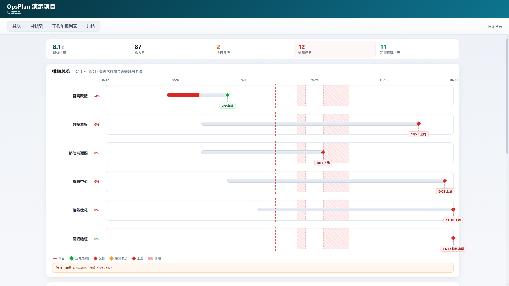
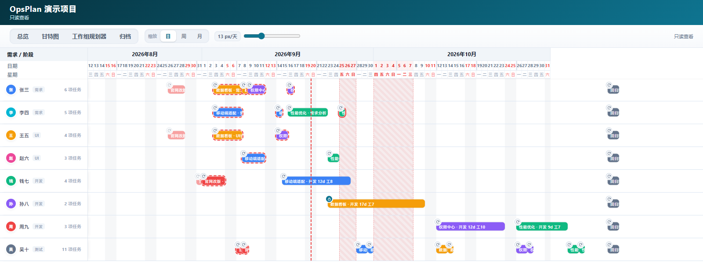
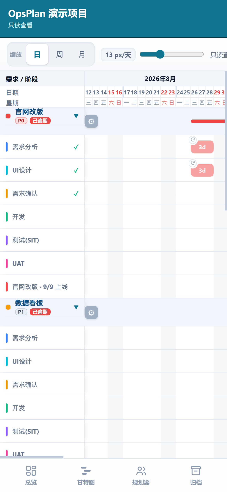

<div align="center">

# OpsPlan · 作战计划

**浏览器里的 Microsoft Project**

依赖驱动 + 资源约束的自动排期 · 冲突扫描 · 甘特 / 资源泳道 / 总览多视图
纯前端、可自托管、数据留在自己手里

*An open-source, self-hosted **gantt chart & project scheduling** tool — a browser-based alternative to Microsoft Project, with dependency-driven auto-scheduling, resource constraints, conflict detection and multi-view planning.*

[](LICENSE)


</div>

---

## 它和别的排期工具不一样在哪

- **桌面端 MS Project**：排期算得准，但是桌面软件、难共享、协作基本没有。
- **主流在线协作工具**：看板/任务做得好，但**依赖推算很弱**——挪动一条前置任务，后续任务不会自动重排，两个人被排在同一天也没人提醒。
- **OpsPlan**：把 MS Project 那套「真算排期」的能力搬进浏览器，并且**可自托管、数据在自己的 Postgres 里**。

## 亮点

| 能力 | 说明 |
|---|---|
| **自动排期** | 任务支持前置依赖（含 lag 提前/延后量）与「手动锁定 / 自动重算」两种模式；拖动前置任务，后续任务沿依赖链级联重排 |
| **资源约束** | 任务可分配多人；排期时按人员占用回溯出「最早可用日期」，人员时间撞车会被扫出来 |
| **工作日历** | 只在工作日排期，自动跳过周末与节假日；内置假期兜底 + 在线节假日日历（带本地缓存），支持调休与自定义假期 |
| **问题扫描** | 依赖环 / 资源过载 / 依赖违反（排期早于前置） / 超期，实时汇总进风险面板并定位到具体任务 |
| **四视图** | **总览**（进度指标 · 需求进度条 · 里程碑时间轴 · 风险 · 资源负载）、**甘特图**（需求行 + 任务条 + 里程碑）、**工作组规划器**（一人一行 · 泳道自动分层 · 未分配归集）、**归档** |
| **里程碑** | 需求确认 / 提测 / 上线等卡点用 0 工期里程碑表达，时间接近时自动上下错层避免压字 |
| **撤销 / 重做** | 快照栈，最多 50 步 |
| **需求管理** | 状态标签、标识色、优先级 P0–P3、描述、需求文档、待排期；归档是**软状态**——归档后的需求仍参与依赖与资源计算，不会静默改变下游排期 |
| **离线导出** | 一键导出**单文件 HTML**（数据注入、JS/CSS 全部内联），发给同事双击即可查看，且可离线继续改；也能导出 JSON 存档 |
| **多项目与权限** | Supabase Auth 邮箱登录、admin / user 两级角色、项目负责人可编辑其余人只读、Postgres RLS 强制隔离 |
| **主题与响应式** | 10 套主题（只换品牌色，完成绿/逾期红/卡点琥珀等数据语义色永不随主题变）；桌面 / 平板 / 手机三档断点共用同一份 DOM |

## 界面预览

**甘特图（实施作战图）** —— 需求行 + 阶段任务条 + 里程碑，节假日与「今天」线直接画在时间轴上



**总览（汇报视图）** —— 一页看完整体进度、总人日、逾期任务、里程碑倒计时与各需求时间条



**工作组规划器** —— 一人一行，任务自动分泳道，未分配的任务单独归集，资源占用一眼看清



**移动端** —— 同一份 DOM 的响应式布局（≤1024 平板 / ≤767 手机），手机上直接看排期



> 以上截图取自只读导出页的内置演示数据（张三 / 李四），非真实项目。

## 快速开始

### 1. 启动前端

```bash
npm install
npm run dev        # http://localhost:8000
```

### 2. 接上后端（必需）

排期数据存在 Supabase（Postgres）里，未配置时页面会直接提示「未配置 Supabase」。

```bash
# 1) 复制配置模板（Windows 用 copy）
cp supabase-config.example.js supabase-config.js
```

打开 `supabase-config.js`，填入 Supabase 控制台 → `Settings → API` 里的 `Project URL` 与 `anon public key`：

```js
window.SUPABASE_CONFIG = {
  url: 'https://xxxx.supabase.co',
  anonKey: 'eyJhbGciOi...'
};
```

```sql
-- 2) 在 Supabase SQL Editor 里执行建表脚本（含触发器与 RLS 策略）
--    文件：deploy/supabase/migration.sql
```

```sql
-- 3) 注册第一个账号后，把它提成管理员（否则没人能建项目）
update public.profiles set role = 'admin' where display_name = '你的名字';
```

### 3. 常用命令

| 命令 | 说明 |
|---|---|
| `npm run dev` | 开发服务器（端口 8000，`--host` 可暴露局域网） |
| `npm run build` | 生产构建多页入口 → `dist/` |
| `npm run build:export` | 生成单文件导出模板 `public/export-template.html` |
| `npm test` | Vitest 跑全部单测（12 个文件 / 271 用例） |

> 改了 `src/` 之后要重新执行 `npm run build:export`，否则导出模板里还是旧代码。

## 架构

```
用户操作 → components 事件层 → scheduler/mutations → planStore.set() → emit() → views 重绘
                                                              ↓
                                                    services/plan-sync（防抖）
                                                              ↓
                                                  Supabase projects.plan (jsonb)
```

- **调度引擎是纯计算**：`src/scheduler/**` 不碰 DOM、不读 window，状态经 `ctx` 注入，因此可以脱离浏览器独立测试（`tests/scheduler.test.js` 30 个用例覆盖拓扑排序、级联重算、资源回溯、问题扫描）。
- **状态是发布-订阅**：`plan-store` / `user-store` 两个极简单例，渲染层订阅后自动重绘；`state` 整体可序列化，所以导出、同步、撤销共用同一份数据。
- **服务层可替换**：`services/supabase.js` 是唯一的客户端入口，想换后端只改这一层（`auth` / `projects` / `plan-sync` 三个门面）。

### 目录结构

```
.
├── index.html                     # 登录 / 项目列表 / 用户管理
├── gantt.html                     # 排期页（实施作战图）
├── 甘特图.html                     # 中文旧链接 → 重定向到 gantt.html
├── supabase-config.example.js      # 后端配置模板（真实配置 supabase-config.js 不入库）
├── deploy/supabase/migration.sql   # 建表 + 触发器 + RLS 策略
├── lib/supabase.js                 # 上游 @supabase/supabase-js 的 UMD 构建（vendored）
├── public/export-template.html     # 单文件导出模板（由 npm run build:export 生成）
├── scripts/verify-export-inject.mjs
├── src/
│   ├── core/          # 常量 / 日期 / 默认数据 / 工作日历 / 主题（10 套）
│   ├── store/         # plan-store（排期状态）· user-store（用户/项目/只读）
│   ├── scheduler/     # topo（Kahn 拓扑）· planning（排期与级联）· mutations（增删改）
│   │                  # problems（问题扫描）· history（撤销重做）· cycle · persistence
│   ├── services/      # supabase 单例 · auth · projects · plan-sync
│   ├── views/         # header · report-view · mod-view · res-view · archive-view · mod-card
│   ├── components/    # shell · toolbar · drawers · modals · drag · context-menu
│   │                  # reslib · theme-picker · sync-status · loading
│   ├── utils/         # dom · export · readonly · theme
│   └── styles/gantt.css
└── tests/             # Vitest：12 文件 / 271 用例
```

## 技术选型：为什么一个框架都不用

前端是**原生 ES Module + 手写 DOM**，没有 React/Vue，不是怀旧，而是这个场景的三个约束：

1. **渲染是高频局部更新**：拖拽时每帧要重算几十条任务条的位置，框架的 diff 反而是负担；
2. **单文件导出**：导出的 HTML 要能内联成一个文件、双击离线可用，运行时依赖越多这个目标越难；
3. **零运行时依赖**：`package.json` 里只有 `vite` / `vitest` / `vite-plugin-singlefile` 三个开发依赖，没有生产依赖。

CSS 用 CSS 变量做主题（`--accent` 一行切换全站品牌色），布局尺寸、断点都收在变量里，PC 与移动端共用一套 DOM。

## Roadmap

- [ ] **关键路径（CPM）分析**：最早/最晚开始、总时差、关键任务高亮
- [ ] 基线保存与偏差对比（计划 vs 实际）
- [ ] 任务实际工时填报与燃尽
- [ ] 导出 Excel / PDF
- [ ] Docker 一键自托管（含 Supabase 自建指引）
- [ ] i18n（当前界面为中文）

## 贡献

欢迎 Issue 和 PR。动手前请先跑一遍测试：

```bash
npm install
npm test            # 271 用例应全绿
npm run build       # 确认构建通过
```

约定：

- 调度引擎（`src/scheduler/**`）保持**纯计算、无 DOM 依赖**，新逻辑优先写单测；
- 新增主题只需在 `src/core/themes.js` 的色表里加一行，其余色阶会自动派生；
- 提交信息用 Conventional Commits（`feat:` / `fix:` / `chore:` / `docs:`）。

## License

[MIT](LICENSE)

## 致谢

- [Supabase](https://supabase.com/) —— Auth + Postgres + RLS
- [timor.tech 节假日 API](https://timor.tech/api/holiday/) —— 在线节假日日历（带本地缓存与兜底）
- [Vite](https://vitejs.dev/) · [Vitest](https://vitest.dev/) · [vite-plugin-singlefile](https://github.com/richardtallent/vite-plugin-singlefile)

---

如果 OpsPlan 对你有帮助，欢迎点个 Star 支持一下；使用中遇到问题或有想法，也欢迎开 [Issue](https://github.com/mlin4020/OpsPlan/issues) 一起讨论。
